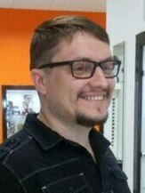

<h2>Клитной Константин</h2>

<a href="https://t.me/kosskafa"> <a href="https://t.me/kosskafa">Константин Kosskafa</a> 

<a href="https://wa.me/79081337818"> <a href="https://wa.me/79081337818">Константин K</a> 

<a href="mailto:kosskafa@gmail.com">&nbsp;<a href="mailto:kosskafa@gmail.com">kosskafa@gmail.com</a>

<a href="tel:+79081337818"><a href="tel:+79081337818">+7(908)133-78-18</a>

16.07.1982г

Воронеж

## Junior QA

### Навыки

* Подготовка и выполнение тест-кейсов, чек-листов;  
* Создание баг-репортов;
* Немного знаком с HTML, CSS+

### Уверенный пользователь:   

* Windows, Android, Google Chrome, Opera, Mozilla Firefox, Yandex, Microsoft Edge, DevTools; 
* Microsoft Office, Google Docs, Яндекс Документы
* Adobe Photoshop, Gimp, CorelDRAW, Sony Vegas, FL Studio  
* Lightshot, Page Ruler, Grid Ruler, Page Load Time, Hola VPN, Bug Magnet, Fireshot, Window Resizer, Exploratory Testing Chrome Extension;
* JIRA, GIT, GITBAG, VSCode, Notepad++

### Уровень английского:  
&nbsp;&nbsp;&nbsp;&nbsp;&nbsp;&nbsp;&nbsp;&nbsp;&nbsp;Basic User

### Образование:  
* ООО "Нетология", Тестировщик ПО 
* Приазовский государственный технический университет, Транспортные технологии

### Интересы:  
&nbsp;&nbsp;&nbsp;&nbsp;&nbsp;&nbsp;&nbsp;&nbsp;&nbsp;Изучать новое, Решать сложные задачи, Тестировать, Анализировать, Создавать сайты, а еще история, играть на гитаре, создавать музыку, вкусно готовить и многое другое.

### Опыт работы:  
&nbsp;&nbsp;&nbsp;&nbsp;&nbsp;&nbsp;&nbsp;&nbsp;&nbsp;Коммерческая деятельность, руководитель филиала (Retail, B2B, B2C), ревизор-инстпектор (Retail).